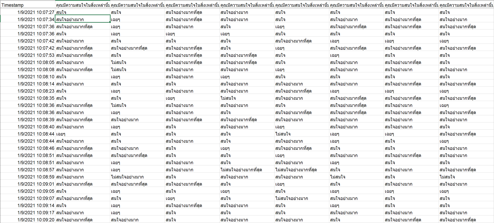
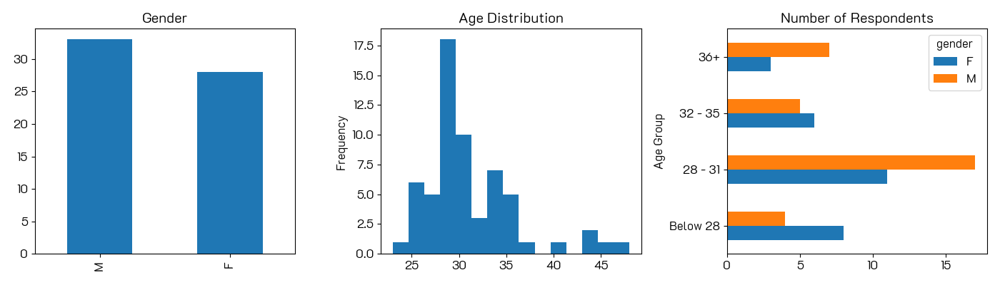
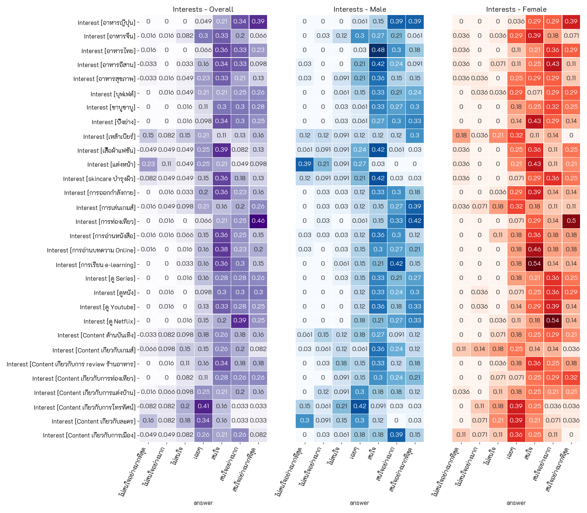
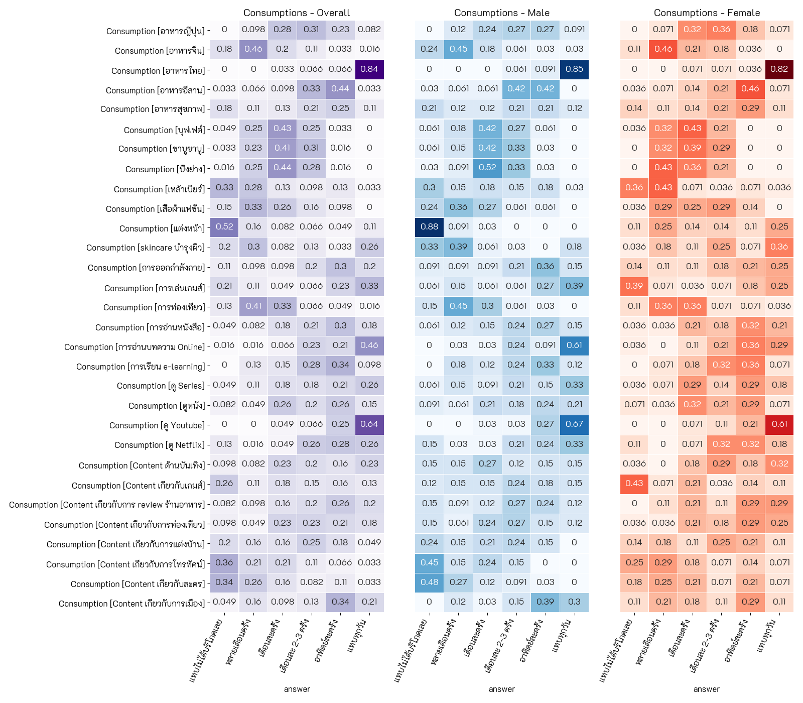
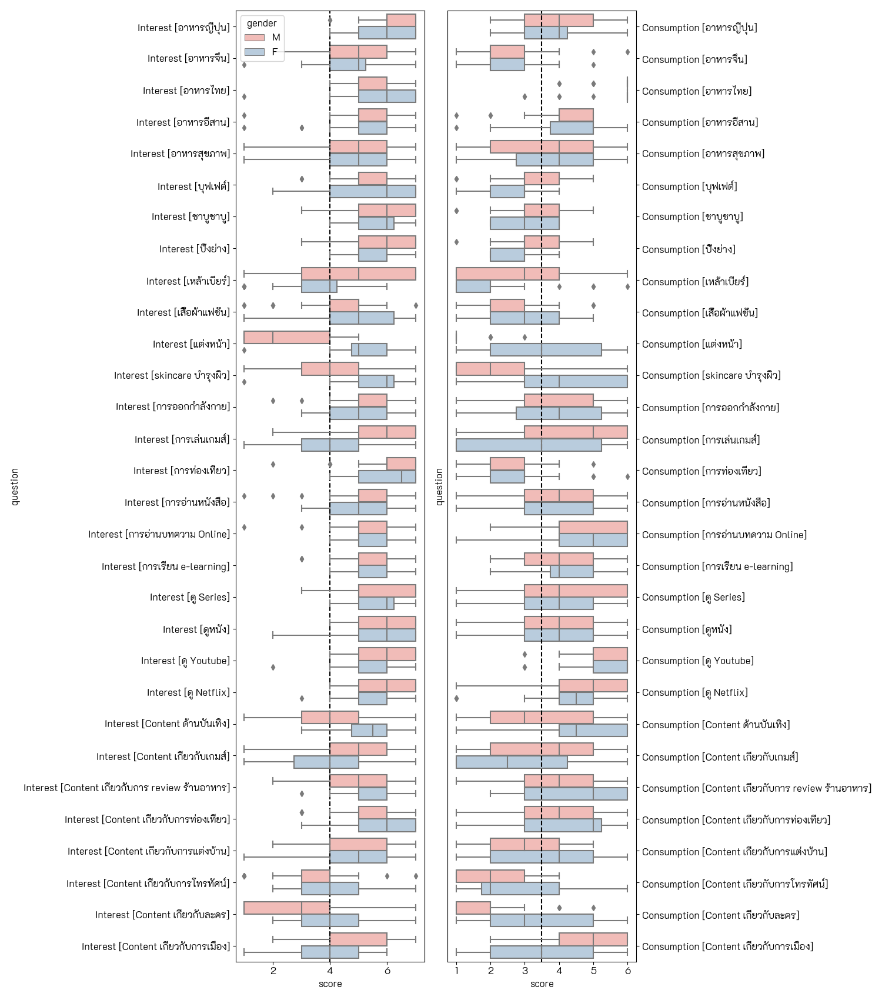
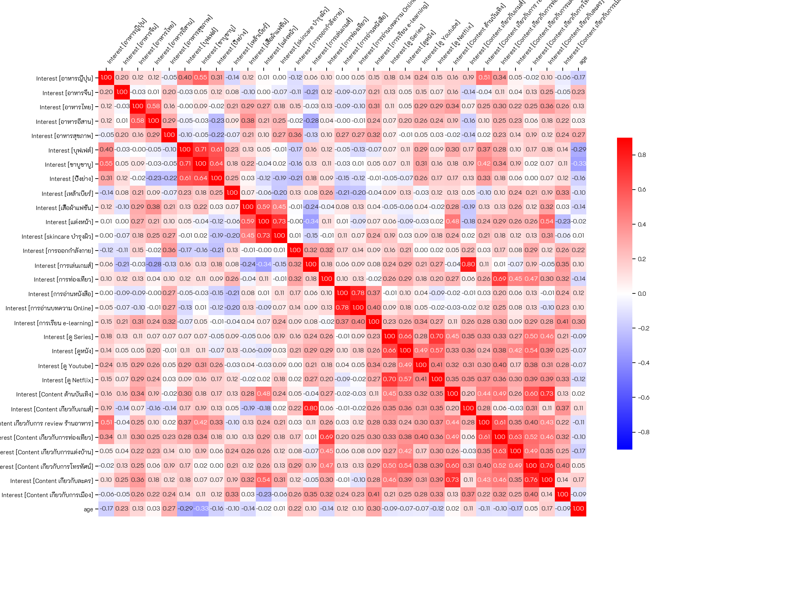
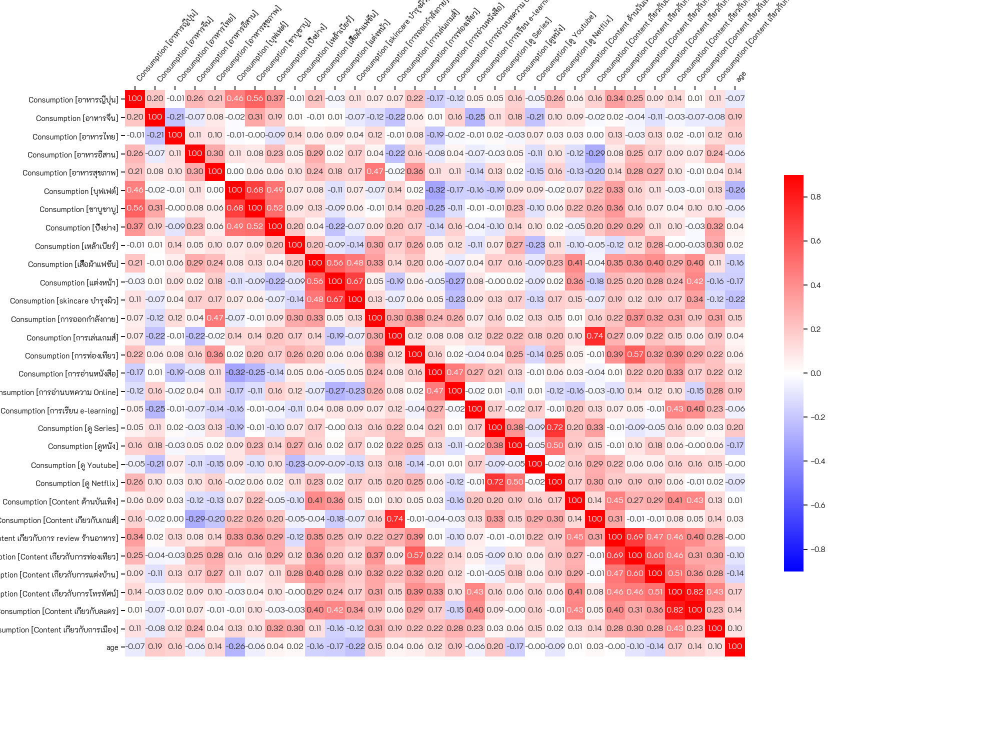
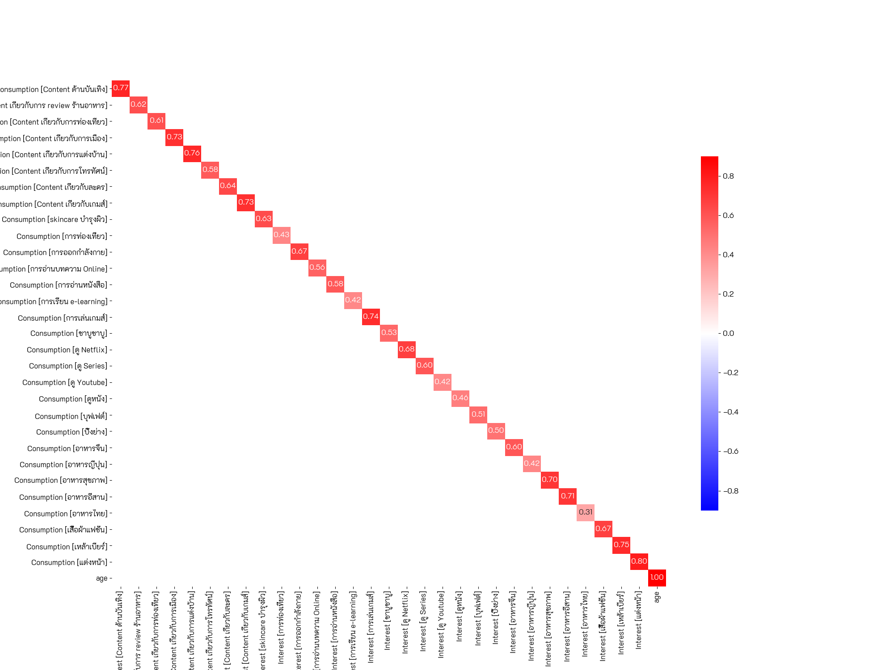
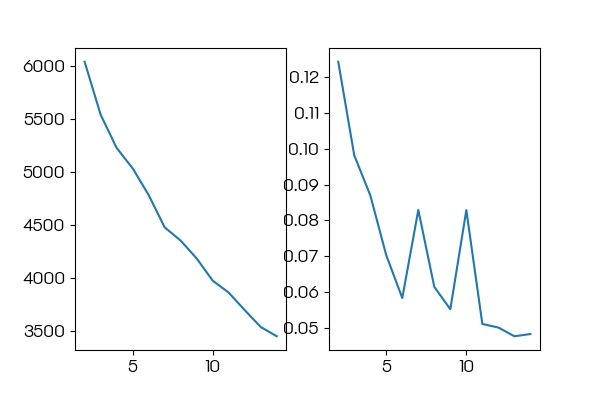

# Customer Behaviors
  
## Introduction
A customer survay "Google form" is export to an excel file (xlsx), then analyzed and shown in this topic.

**Raw Data File :** [Excel Raw Data](./%5BRaw%20Data%5D%20Customer%20Behaviors%20(Responses).xlsx)  
**Jupyter Notebook File :** [Analysis of Customer Behaviors](./HW%201.ipynb)  
 
## Contents
### Raw Data

### Demographic
The respondents mainly age 28 years old, with approximately half male and female. 

### Scoring
How much people interest and consumption things in each categories.
#### Interests
**No surprising** : 
Men are intereting on Games, Beers than female.
Female are interesing on Make-Up than men.

#### Consumptions

### Paired Distribution
Comparing distributions of the responses on both interest and consumption in the same topic.  

### Correlation of Interests

### Correlation of Consumptions

### Correlation between Interests and Consumptions
**Surprising result** : People who consumptions thai food is low correlate with interest thai food.

### K-Means [Unsupervised Learning]
No appropiate cluster could be made from this data. the reasons are including less number of responded(63) comparing to the number of features(60).

