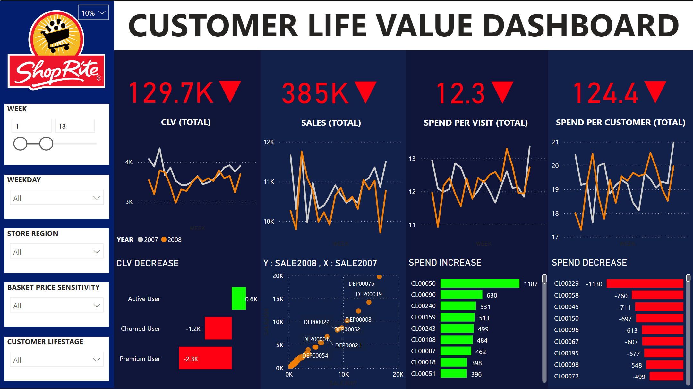

# CLV Dashboard

This study aims to create CLV dashboard for supermarket dataset. Customer Lifetime Value (CLV) can be calculated from 4 parameters as equation below:

CLV = T x AOV x AGM x ALT

- Average number of transaction per month (T)
- Average order value (AOV)
- Average gross margin (AGM)
- Average customer lifespan in month (ALT)

## Assumptions

- Gross margin is  10% (Optional Change in DashBoard)
- Churn rate for ALT is using [Homewok 10](https://github.com/PawarutK/BADS7105/tree/main/HW%2010) 
- Customer Segmentation is using [Homework 06](https://github.com/PawarutK/BADS7105/tree/main/HW%2006) 

## Dashboard Purpose
- Monitoring CLV (YoY)
- Possible rootcauses and solution

## Insight form Dashboard
  - CLV of 2008 is decreased. (YoY)
  - Totol sales decreases related to decreases in spending per visit and spending per customer.
  - Even DEP00076 do great job to increase the sales, but other departments are still below the target line.
  - Premium customers trend to decrease buying product from the supermarket.

***CLV Dashboard***

