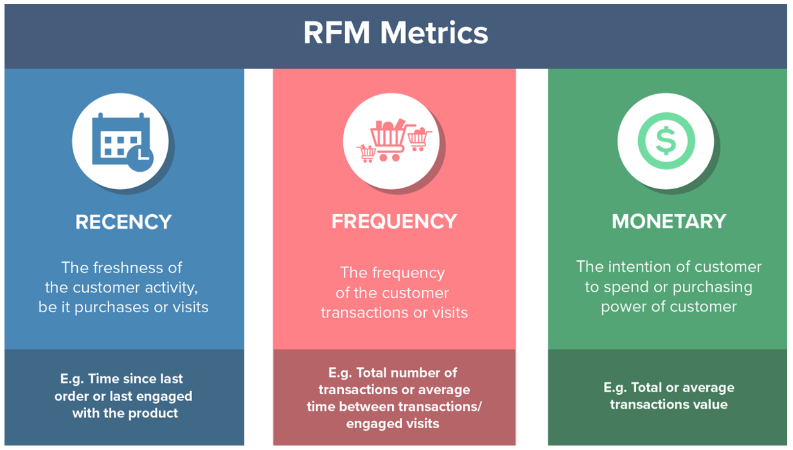
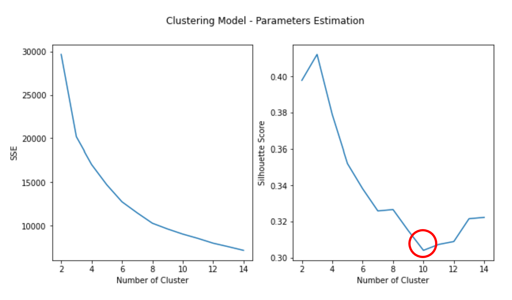
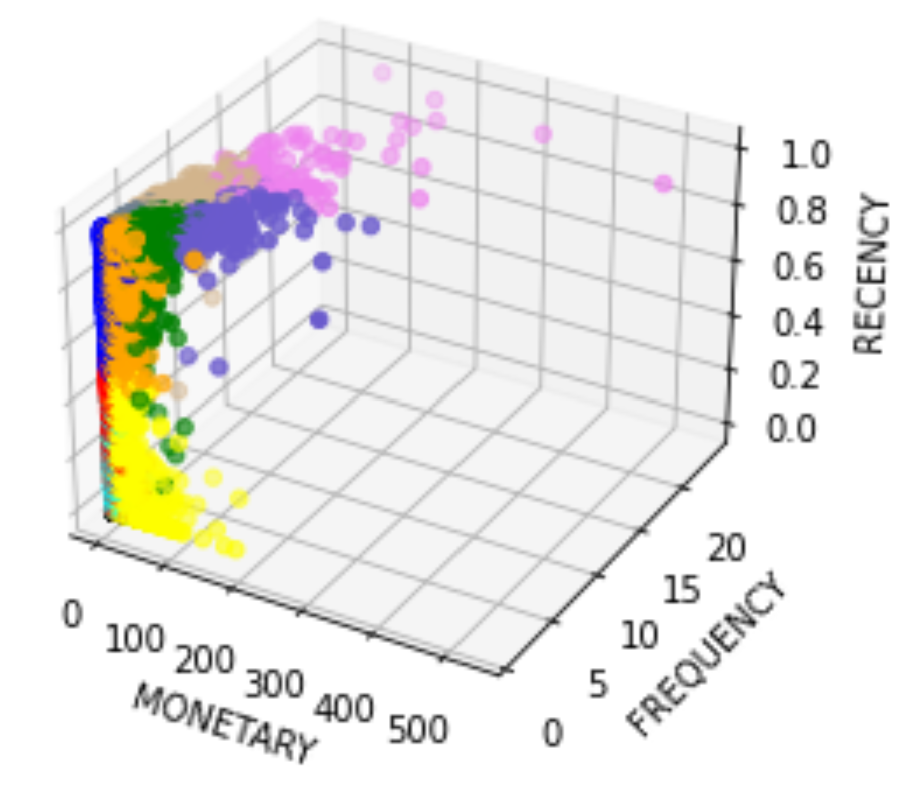
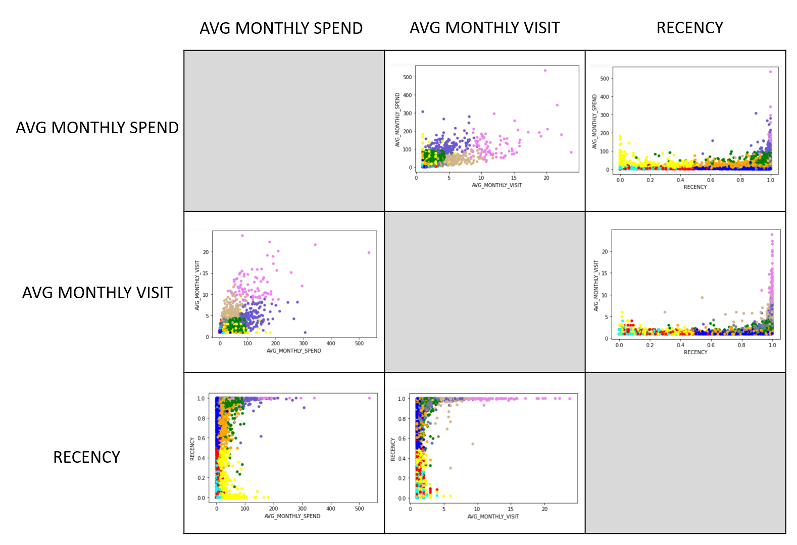

# Customer Segmentation


## Import Data from Google BigQuery

The supermarket dataset contains 956K records between year 2006 to 2008. Features are created during query data from Google BigQuery which contain:
- **TOTAL_SPEND** = Total spending for each customer
- **AVG_MONTHLY_SPEND** = Average monthly spending for each customer
- **STD_MONTLY_SPEND** = Standard deviation of monthly spending for each customer
- **TOTAL_VISIT** = Total visit for each customer
- **AVG_MONTHLY_VISIT** = Average monthly visit for each customer
- **STD_MONTLY_VISIT** = Standard deviation of monthly visit for each customer
- **MODE_BASKET_SIZE** = Favorite basket site for each customer
- **DURATION_FROM_FIRST_PURCHASE** = Time since first purchase to now (2008-07-06) for each customer
- **DURATION_FROM_LAST_PURCHASE** = Time since last purchase to now (2008-07-06) for each customer
- **CUST_LIFETIME** = Time between first purchase and last purchase for each customer

```sql
SELECT
    S.CUST_CODE,
    SUM(S.SPEND) AS TOTAL_SPEND,
    AVG(M.MONTHLY_SPEND) AS AVG_MONTHLY_SPEND,
    STDDEV_POP(M.MONTHLY_SPEND) AS STD_MONTHLY_SPEND,
    COUNT(DISTINCT S.BASKET_ID) AS TOTAL_VISIT,
    AVG(M.MONTHLY_VISIT) AS AVG_MONTHLY_VISIT,
    STDDEV_POP(M.MONTHLY_VISIT) AS STD_MONTHLY_VISIT,
    CASE
    WHEN SUM(CASE WHEN S.BASKET_SIZE='L' THEN 1 ELSE 0 END) >= SUM(CASE WHEN S.BASKET_SIZE='S' THEN 1 ELSE 0 END)
     AND SUM(CASE WHEN S.BASKET_SIZE='L' THEN 1 ELSE 0 END) >= SUM(CASE WHEN S.BASKET_SIZE='M' THEN 1 ELSE 0 END) THEN 3
    WHEN SUM(CASE WHEN S.BASKET_SIZE='M' THEN 1 ELSE 0 END) >= SUM(CASE WHEN S.BASKET_SIZE='S' THEN 1 ELSE 0 END)
     AND SUM(CASE WHEN S.BASKET_SIZE='M' THEN 1 ELSE 0 END) >= SUM(CASE WHEN S.BASKET_SIZE='L' THEN 1 ELSE 0 END) THEN 2
    WHEN SUM(CASE WHEN S.BASKET_SIZE='S' THEN 1 ELSE 0 END) >= SUM(CASE WHEN S.BASKET_SIZE='M' THEN 1 ELSE 0 END)
     AND SUM(CASE WHEN S.BASKET_SIZE='S' THEN 1 ELSE 0 END) >= SUM(CASE WHEN S.BASKET_SIZE='L' THEN 1 ELSE 0 END) THEN 1
    END AS MODE_BASKET_SIZE,
    DATE_DIFF(PARSE_DATE('%Y%m%d', CAST(MAX(S.SHOP_DATE) AS STRING)), PARSE_DATE('%Y%m%d', CAST(MIN(S.SHOP_DATE) AS STRING)), DAY) AS CUST_LIFETIME,
    DATE_DIFF(DATE'2008-07-06', PARSE_DATE('%Y%m%d', CAST(MIN(S.SHOP_DATE) AS STRING)), DAY) AS DURATION_FROM_FIRST_PURCHASE,
    DATE_DIFF(DATE'2008-07-06', PARSE_DATE('%Y%m%d', CAST(MAX(S.SHOP_DATE) AS STRING)), DAY) AS DURATION_FROM_LAST_PURCHASE
FROM
    `hw10-cma.customer.supermarket` AS S
INNER JOIN (
    SELECT
        CUST_CODE,
        LEFT(CAST(SHOP_DATE AS STRING), 6) AS SHOP_MONTH,
        SUM(SPEND) AS MONTHLY_SPEND,
        COUNT(DISTINCT BASKET_ID) AS MONTHLY_VISIT
    FROM
        `hw10-cma.customer.supermarket`
    GROUP BY
        CUST_CODE, SHOP_MONTH
) AS M ON S.CUST_CODE = M.CUST_CODE
WHERE
    S.CUST_CODE IS NOT NULL
GROUP BY
    S.CUST_CODE
ORDER BY
    S.CUST_CODE
```

## RFM Theory
from RFM theory about customer, RECENCY feature was added before custering

RECENCY = (DURATION_FROM_FIRST_PURCHASE - DURATION_FROM_LAST_PURCHASE) / DURATION_FROM_FIRST_PURCHASE

ther nearly 1 is the most recently customer, the longest can refer to churn chustomer.




## Clustering Model

To select how many cluster should be used for the supermarket dataset, Elbow method and Silhouette is applied. From the pictures below, 10-cluster (K=10) is selected because the more number of clusters, the less Silhouette.



## Clustering Analysis

After Clustering Completed, it was shown in 3D graphical (AVG_MONTHLY_SPEND, AVG_MONTHLY_VISIT, RECENCY) with 10 colors.



### Exploratory Data Analysis



## Interpretation and Possible Action


