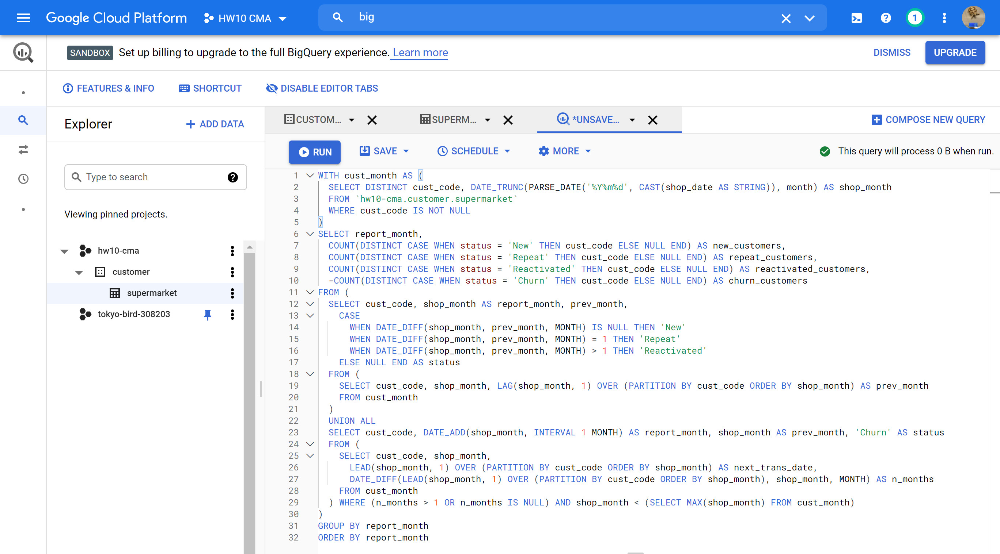
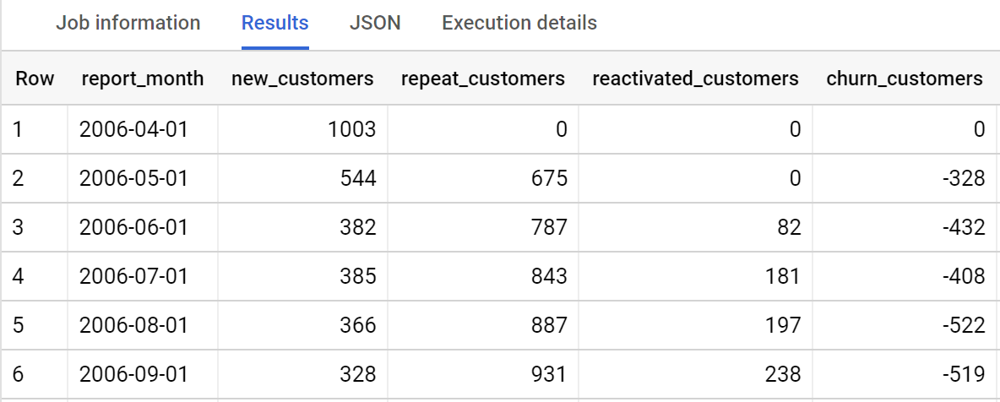

# Customer Movement Analysis

## Data Preparation

This study has been done by using SQL script below.

```SQL
WITH cust_month AS (
  SELECT DISTINCT cust_code, DATE_TRUNC(PARSE_DATE('%Y%m%d', CAST(shop_date AS STRING)), month) AS shop_month
  FROM `hw10-cma.customer.supermarket`
  WHERE cust_code IS NOT NULL
)
SELECT report_month,
  COUNT(DISTINCT CASE WHEN status = 'New' THEN cust_code ELSE NULL END) AS new_customers,
  COUNT(DISTINCT CASE WHEN status = 'Repeat' THEN cust_code ELSE NULL END) AS repeat_customers,
  COUNT(DISTINCT CASE WHEN status = 'Reactivated' THEN cust_code ELSE NULL END) AS reactivated_customers,
  -COUNT(DISTINCT CASE WHEN status = 'Churn' THEN cust_code ELSE NULL END) AS churn_customers
FROM (
  SELECT cust_code, shop_month AS report_month, prev_month,
    CASE 
      WHEN DATE_DIFF(shop_month, prev_month, MONTH) IS NULL THEN 'New'
      WHEN DATE_DIFF(shop_month, prev_month, MONTH) = 1 THEN 'Repeat'
      WHEN DATE_DIFF(shop_month, prev_month, MONTH) > 1 THEN 'Reactivated'
    ELSE NULL END AS status
  FROM (
    SELECT cust_code, shop_month, LAG(shop_month, 1) OVER (PARTITION BY cust_code ORDER BY shop_month) AS prev_month
    FROM cust_month
  )
  UNION ALL
  SELECT cust_code, DATE_ADD(shop_month, INTERVAL 1 MONTH) AS report_month, shop_month AS prev_month, 'Churn' AS status
  FROM (
    SELECT cust_code, shop_month,
      LEAD(shop_month, 1) OVER (PARTITION BY cust_code ORDER BY shop_month) AS next_trans_date,
      DATE_DIFF(LEAD(shop_month, 1) OVER (PARTITION BY cust_code ORDER BY shop_month), shop_month, MONTH) AS n_months
    FROM cust_month
  ) WHERE (n_months > 1 OR n_months IS NULL) AND shop_month < (SELECT MAX(shop_month) FROM cust_month)
)
GROUP BY report_month
ORDER BY report_month
```

## Procedure
Using Gooble BIG QUERY </br>
 </br>

QUERY RESULT </br>
 </br>

Using Google studio for VISUALIZATION </br>
 </br>

