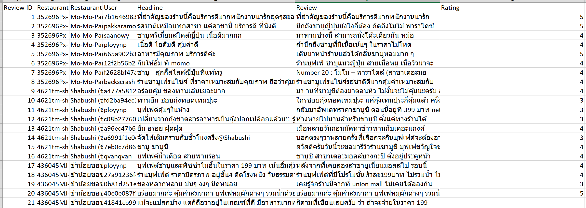
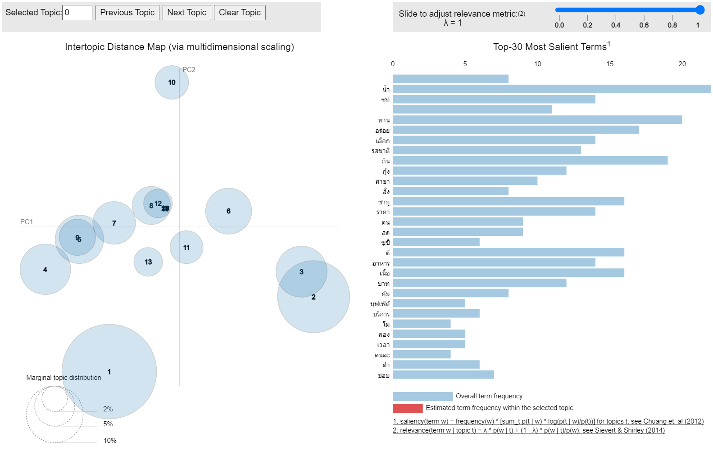

# Voice of Customers

## 1) DataSet
Customer reviews of 3 restaurants from Wongnai - only 21 instances.

## 2) Visulization Model as a result

## 3) Procedure
1. Import Data  
2. Cleanning  
3. Set a Dictionary of Words  
4. Model Visuallization  
 
Relate Library : pythainlp, gensim, pyLDAvis
